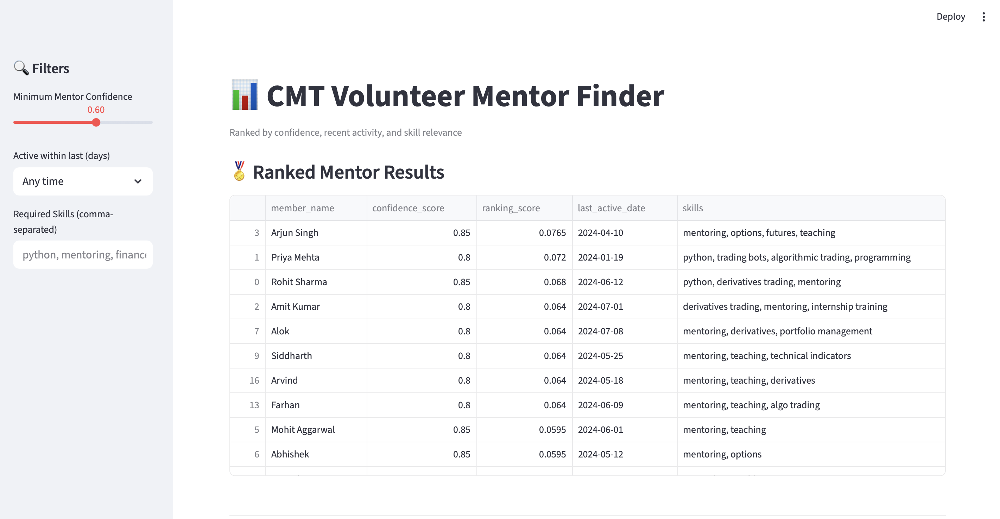
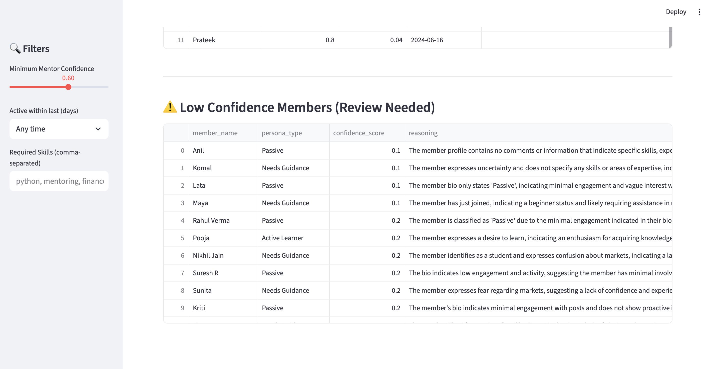
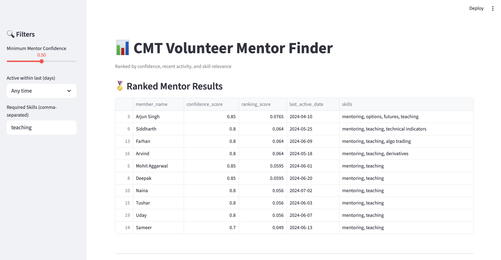
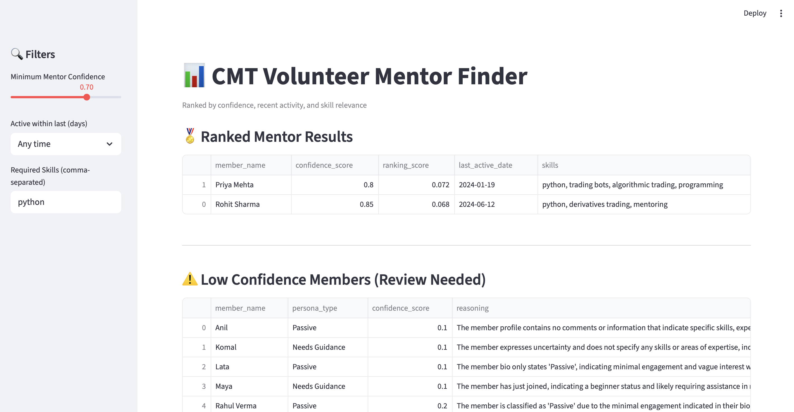
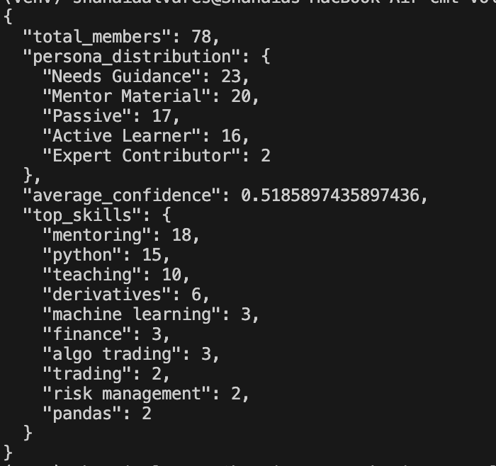
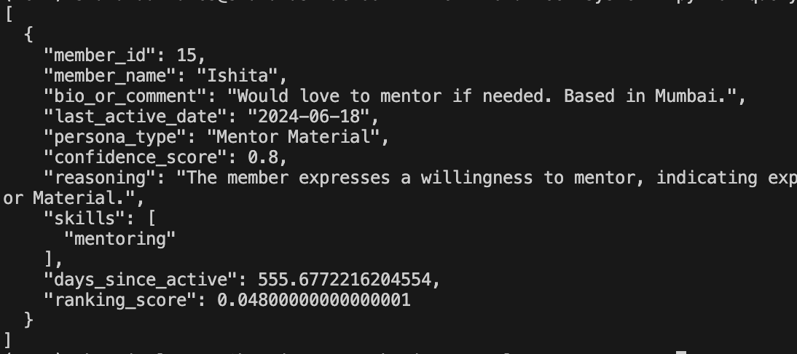
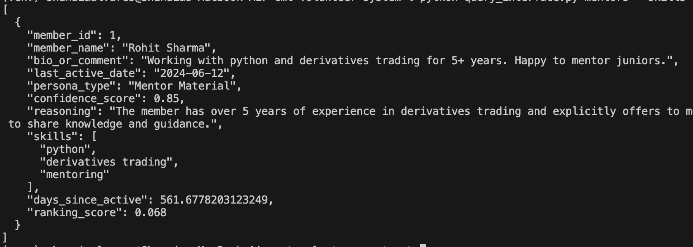
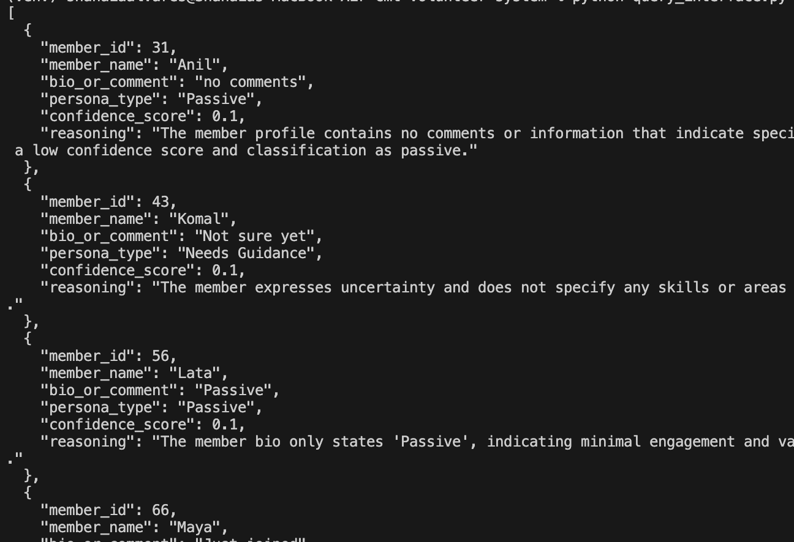

#  CMT Volunteer-First Operating System

This system is an automated **ETL and AI-Enrichment pipeline** developed for the **CMT Association**. It transforms raw member data into a searchable intelligence layer, using Generative AI to identify and rank volunteer mentors based on skills, recency, and persona suitability.

##  System Architecture

The project is built on a four-layer architecture to ensure modularity and high engineering standards:

1. **ETL Layer (`main.py`)**: Handles data ingestion, multi-format date normalization, and error logging for invalid records.
2. **Brain Layer (`ai_enrichment.py`)**: Uses **Gemini 1.5 Flash** (via OpenRouter) to analyze bios, extract skills, and classify personas with confidence scores.
3. **Truth Layer (`database.py`)**: A normalized **SQLite** schema that supports versioned enrichment runs and audit trails.
4. **Interface Layer (`streamlit_app.py` & `query_interface.py`)**: Provides both a web UI and a CLI for compound queries and mentor ranking.

##  Setup & Installation

### 1. Environment Setup

Clone the repository and set up a virtual environment:

```bash
# Create virtual environment
python -m venv venv

# Activate virtual environment
# On macOS/Linux:
source venv/bin/activate
# On Windows:
venv\Scripts\activate

```

### 2. Install Dependencies

```bash
pip install -r requirements.txt

```

### 3. Configuration

Set your OpenRouter API Key as an environment variable:

```bash
export OPENROUTER_API_KEY='your_api_key_here'

```

### 4. Verify System Readiness

Run the pre-flight check script to ensure the API, CSV, and Database paths are ready:

```bash
python test_system.py

```

##  Running the Pipeline

To process raw data and populate the database:

```bash
python pipeline.py members_raw.csv

```

This script will:

1. Normalize names and dates.
2. Call the AI Brain to enrich bios.
3. Store structured data in `volunteer_data.db`.
4. Generate a summary of personas and skills found.

-------------
##  Querying & UI

###  Web Interface (Streamlit)

Launch the ranking dashboard:

```bash
streamlit run streamlit_app.py
```

####  Dashboard Screenshots






---

###  CLI Query Engine (`query_interface.py`)

Run compound queries directly from the terminal:

---

####  Get database statistics

```bash
python query_interface.py stats
```



---

####  Find mentors by location

```bash
python query_interface.py mentors --location Mumbai
```



---

####  Find mentors with specific skills

```bash
python query_interface.py mentors --skills python mentoring --min-confidence 0.7
```



---

####  Audit low-confidence records

```bash
python query_interface.py low-confidence --threshold 0.4
```



---

##  Design for Change & Quality Control

* **Config-Driven Prompts**: AI logic is managed in `prompts_config.json`, allowing for prompt engineering without code changes.
* **Versioned Truth**: The database uses `enrichment_version` and `is_current` flags to maintain a history of member classifications.
* **Low Confidence Flagging**: Records with ambiguous bios (e.g., "Not sure yet") are assigned low confidence scores (0.1) by the AI, triggering a manual review flag in the UI.

##  Database Schema

| Table | Column Focus |
| --- | --- |
| **members** | `member_id`, `member_name`, `bio_or_comment`, `last_active_date` |
| **member_personas** | `persona_type`, `confidence_score`, `reasoning`, `is_current` |
| **skills** | `skill_name`, `category` |
| **member_skills** | Many-to-Many mapping with `confidence` and `version` |

---
